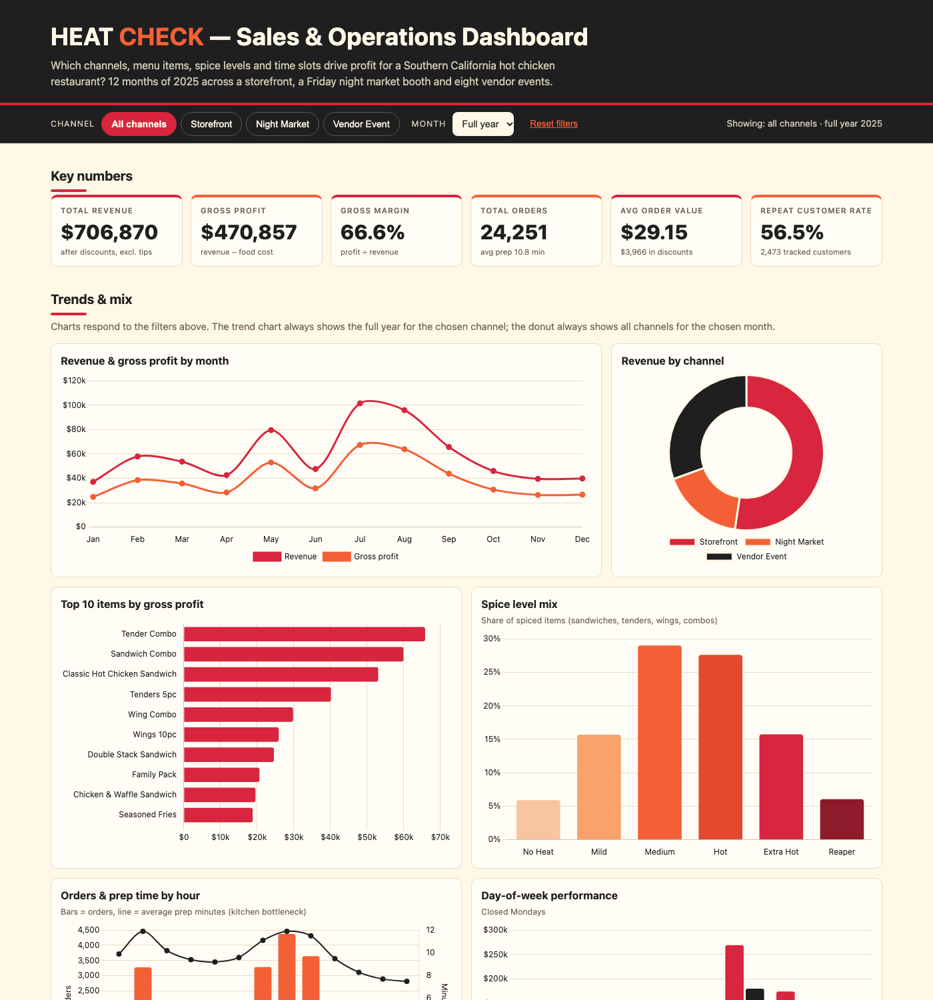
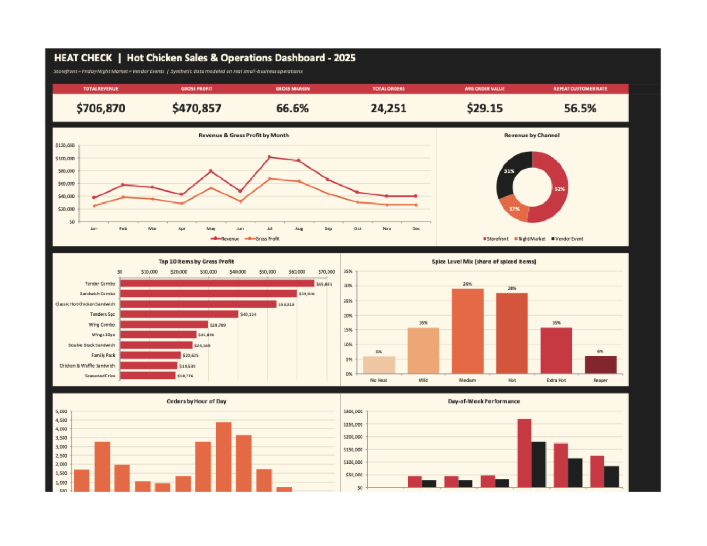
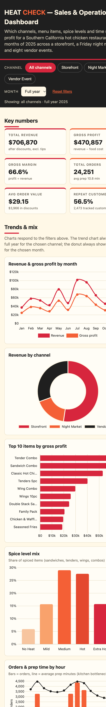
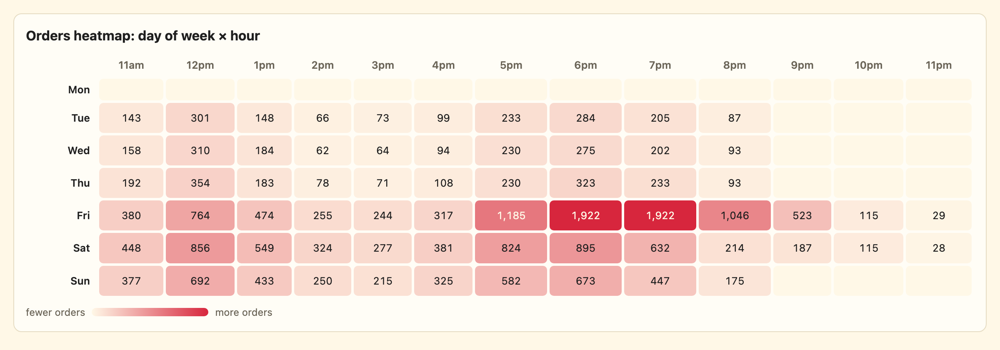
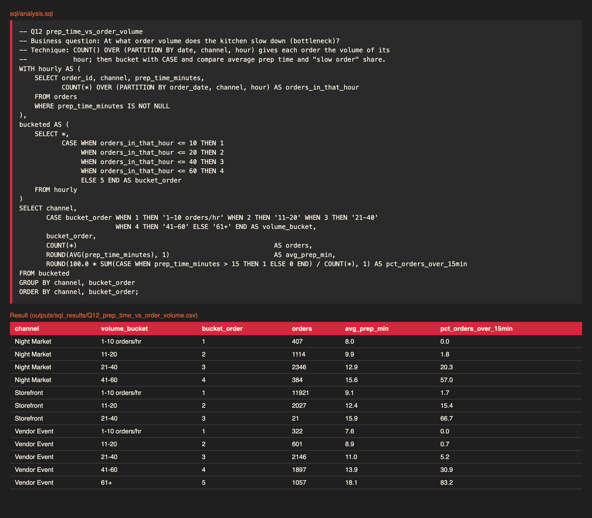
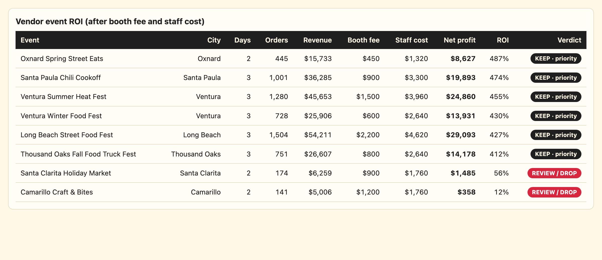

# 🔥 Heat Check: Sales & Operations Analysis for a Hot Chicken Restaurant

**An end-to-end analytics project that finds which channels, menu items, spice levels and time slots drive profit, and tells the owner where to focus staff, inventory and marketing next year.**


### 👉 [Live Dashboard](https://amanubhi.github.io/Heat-Check---Sales-Operations-Dashboard/) &nbsp;|&nbsp; [Insights report](reports/insights.md) &nbsp;|&nbsp; [SQL analysis](sql/analysis.sql) &nbsp;|&nbsp; [Excel guide](excel/README_excel.md)



---

## 📌 Business problem

Heat Check is a small hot chicken restaurant in Southern California that sells through **three channels**:

1. **Storefront**: open Tue-Sun, every day.
2. **Friday Night Market**: a weekly booth.
3. **Vendor events**: eight festivals and fairs, 2-3 days each.

The owner has sales data from all three but no clear answer to:

> **Which channels, menu items, spice levels and time slots drive profit, and where should I focus staff, inventory and marketing next year?**

This project answers that with cleaned data, 15 SQL queries, an Excel dashboard, an interactive web dashboard and a consultant-style recommendations report.

## 🧾 Key results at a glance (2025)

| Revenue | Gross profit | Gross margin | Orders | Avg order value | Repeat customer rate |
|---:|---:|---:|---:|---:|---:|
| **$706,870** | **$470,857** | **66.6%** | **24,251** | **$29.15** | **56.5%** |

## 💡 Top 5 insights

*(full write-up with reasoning and actions in [`reports/insights.md`](reports/insights.md))*

1. **Vendor events earn 31% of revenue in 21 of 310 selling days.** Six of eight return 412-487% on booth fee plus staff cost; two (Camarillo, Santa Clarita) return only 12-56%. **Keep six, replace two.**
2. **Tue-Thu storefront shifts lose money on labor.** Daily gross profit of $568-$653 is below the $660 cost of a 3-person crew. Running 2 staff mid-week saves about **$33.9k a year**.
3. **The event kitchen is the bottleneck.** Prep time jumps from 7.6 to **18.1 minutes** in hours above 60 orders, and 83% of those orders wait over 15 minutes. A second fry station is the highest-leverage fix.
4. **Wings have the lowest margin (57%) and drinks the highest (81%).** A $1 wings increase plus a drink add-on program is worth roughly **$13k**.
5. **Loyalty members are worth about 2x per customer** ($137 vs $70) and repeat at 68% vs 48%, yet only 8% of event orders are linked to a customer. **Capture sign-ups at the booth.**

## 🗂️ Dataset

**Synthetic data**: 12 months (Jan-Dec 2025), about 24k orders, generated in Python with a fixed random seed so it is fully reproducible. It is modeled on real small-business patterns: Friday/Saturday evening peaks, a lunch rush from 11:30 to 1:30, summer event spikes, larger parties (higher order value) at events, Medium/Hot as the most popular heat levels, longer prep times during rushes, and about 5% of orders with discounts. Deliberate data-quality problems (duplicates, missing zips, negative quantities, inconsistent capitalization, impossible prep times) are injected so the cleaning step is real.

> **Note:** all data is fictional. No real customers, sales or events are included.

### Data dictionary (clean tables in `data/clean/`)

**`orders`**: one row per order

| Column | Type | Description |
|---|---|---|
| `order_id` | text | Unique order ID (`HC000001`...) |
| `order_datetime` / `order_date` | datetime / date | When the order was placed |
| `channel` | text | Storefront, Night Market, Vendor Event |
| `event_name` | text | Name of the vendor event (blank otherwise) |
| `payment_method` | text | Card, Cash, Apple Pay, Online |
| `order_type` | text | Dine-in, Takeout, Delivery App |
| `customer_id` | text | Customer ID (blank for walk-ups) |
| `loyalty_member` | bool | Whether the customer is a loyalty member (blank if unknown) |
| `discount_amount` | $ | Order-level discount |
| `tip_amount` | $ | Tip (**not** counted as revenue) |
| `prep_time_minutes` | number | Minutes from order to ready |
| `item_count` | int | Total items in the order |
| `subtotal` | $ | Item sales before discount |
| `revenue` | $ | `subtotal - discount_amount` |
| `food_cost_total` | $ | Sum of item food cost |
| `gross_profit` | $ | `revenue - food_cost_total` |
| `gross_margin_pct` | % | `gross_profit / revenue x 100` |
| `hour`, `day_of_week`, `day_of_week_num`, `month`, `month_name`, `quarter` | calc | Time parts (`day_of_week_num`: Mon=0) |
| `is_weekend` | bool | Saturday or Sunday |
| `daypart` | text | Lunch (11-2pm), Afternoon (2-5pm), Dinner (5-9pm), Late Night (9pm+) |
| `days_to_repeat_order` | int | Days since this customer's previous order (blank for first orders / walk-ups) |

**`order_items`**: one row per item line in an order

| Column | Type | Description |
|---|---|---|
| `line_id`, `order_id`, `item_id` | key | Identifiers |
| `level_id` / `spice_level` | int / text | Heat level (blank / `Not Applicable` for sides and drinks) |
| `quantity`, `unit_price` | number | Units and price per unit |
| `item_name`, `category`, `unit_food_cost` | text/$ | Joined from `menu` |
| `line_revenue`, `line_food_cost` | $ | `quantity x price` / `quantity x cost` |
| `line_discount` | $ | The order's discount spread across lines by value |
| `line_profit` | $ | `line_revenue - line_discount - line_food_cost` |

**`customers`**: one row per tracked customer

| Column | Type | Description |
|---|---|---|
| `customer_id` | text | Customer ID |
| `first_order_date`, `first_order_month` | date / text | First order in the data, used for cohorts |
| `zip_code`, `county` | text | Ventura / Los Angeles / Unknown |
| `loyalty_member` | bool | Loyalty program member |
| `total_orders`, `total_revenue` | int / $ | Lifetime totals |
| `days_to_second_order` | int | Days from first to second order (blank if none) |

**`menu`** (`item_id`, `item_name`, `category`, `base_price`, `food_cost`, `is_combo`), **`spice_levels`** (`level_id`, `level_name`, `heat_rank`), **`events`** (`event_name`, `start_date`, `end_date`, `booth_fee`, `staff_count`, `city`, `event_days`).

Every cleaning step, with row counts, is logged in [`data/cleaning_log.md`](data/cleaning_log.md).

## 🛠️ Tools & skills demonstrated

| Skill | How it shows up |
|---|---|
| **Data generation** | Seeded, realistic synthetic data with seasonality, rush patterns and injected errors (`scripts/generate_data.py`) |
| **Data cleaning** | De-duplication, standardizing text, fixing impossible values, validation checks, a change log (`scripts/clean_data.py`) |
| **SQL** | 15 documented queries using CTEs, window functions (`RANK`, `LAG`, running totals, `PARTITION BY`), `CASE`, joins, cohort analysis (`sql/analysis.sql`) |
| **Excel** | Excel Tables, 280+ live `SUMIFS`/`COUNTIFS` formulas, 6 native charts, KPI cards, conditional-format heatmap, pivot/slicer guide |
| **Visualization** | Interactive Chart.js dashboard with filters, responsive layout and a brand color theme |
| **Business storytelling** | Findings framed as number -> why it matters -> recommendation, with dollar impact and stated assumptions (`reports/insights.md`) |
| **Engineering hygiene** | One-command pipeline, no hardcoded paths, reproducible seed, `requirements.txt`, MIT license |

## 📁 Project structure

```
.
├── README.md
├── LICENSE
├── requirements.txt
├── run_all.py                     # runs the whole pipeline
├── assets/                        # screenshots used in this README
├── data/
│   ├── raw/                       # synthetic CSVs with injected quality issues
│   ├── clean/                     # cleaned CSVs with calculated fields
│   ├── cleaning_log.md            # every change made during cleaning
│   └── heatcheck.db               # SQLite database (built from clean data)
├── docs/                          # GitHub Pages site
│   ├── index.html                 # self-contained interactive dashboard
│   └── .nojekyll
├── excel/
│   ├── HeatCheck_Dashboard.xlsx
│   └── README_excel.md            # pivot tables + slicers to add manually
├── outputs/
│   └── sql_results/               # one CSV per SQL query
├── reports/
│   └── insights.md                # findings and recommendations
├── scripts/
│   ├── paths.py                   # all file paths in one place
│   ├── generate_data.py           # step 1
│   ├── clean_data.py              # step 2
│   ├── build_database.py          # step 3a: CSV -> SQLite
│   ├── run_sql_analysis.py        # step 3b: run queries, export CSVs
│   ├── build_excel.py             # step 4
│   ├── export_dashboard_data.py   # step 5
│   └── templates/dashboard_template.html
└── sql/
    └── analysis.sql               # 15 commented queries
```

## 📸 Screenshots

| Excel dashboard | Web dashboard (desktop) | Web dashboard (mobile) |
|---|---|---|
|  |  |  |

| Day x hour heatmap | SQL query output | Event ROI table |
|---|---|---|
|  |  |  |

*(Add your screenshots to the `assets/` folder using these file names.)*

## ▶️ How to reproduce

Requires Python 3.10+ (tested on 3.13).

```bash
# 1. Get the code
git clone https://github.com/amanubhi/Heat-Check---Sales-Operations-Dashboard.git
cd Heat-Check---Sales-Operations-Dashboard

# 2. Create an environment and install dependencies
python3 -m venv .venv
source .venv/bin/activate          # Windows: .venv\Scripts\activate
pip install -r requirements.txt

# 3. Run everything (about 10 seconds)
python run_all.py
```

Or run each step on its own, always from the repo root:

```bash
python scripts/generate_data.py          # 1. raw CSVs -> data/raw/
python scripts/clean_data.py             # 2. clean CSVs -> data/clean/ + cleaning_log.md
python scripts/build_database.py         # 3a. SQLite -> data/heatcheck.db
python scripts/run_sql_analysis.py       # 3b. 15 query results -> outputs/sql_results/
python scripts/build_excel.py            # 4. excel/HeatCheck_Dashboard.xlsx
python scripts/export_dashboard_data.py  # 5. docs/index.html
```

Open `docs/index.html` in any browser to view the dashboard locally. Requirements: `pandas`, `numpy`, `xlsxwriter`.

## ⚠️ Assumptions & limitations

- **Synthetic data.** Findings describe this simulated business, not a real one.
- **Revenue** = item sales minus discounts (tips excluded). **Gross profit** = revenue minus food cost.
- **Labor and booth costs are assumptions**, not in the raw data: $22/hr loaded labor; storefront 3 staff x 10 hrs (+2.5 hrs Fri/Sat); night market 3 staff x 6 hrs + $85 booth; events use actual booth fee and staff count x 10 hrs/day. Rent and owner pay are excluded. Edit them in the `assumptions` CTEs of `sql/analysis.sql`.
- **Customer metrics** cover only orders with a customer ID (about 35% of orders). Customers already active in January are all grouped in the January cohort.

## 👤 About me

**Amanjot Ubhi** | Aspiring Data Analyst & Project Coordinator  
📍 Los Angeles, CA &nbsp;|&nbsp; ✉️ [amanubhi555@gmail.com](mailto:amanubhi555@gmail.com) &nbsp;|&nbsp; 💼 [LinkedIn](https://www.linkedin.com/in/amanubhi1) &nbsp;|&nbsp; 🐙 [GitHub](https://github.com/amanubhi)

I'm looking for Project Coordinator and Data Analyst roles where I can turn messy data into clear decisions. I built Heat Check to practice the full analyst workflow: cleaning data, answering business questions with SQL, building dashboards in Excel and on the web, and presenting recommendations a business owner can act on.

## 🌐 Publish the dashboard (GitHub Pages)

1. Push this repo to GitHub.
2. Go to **Settings -> Pages**.
3. Under **Build and deployment -> Source**, choose **Deploy from a branch**.
4. Set **Branch** to `main` and the folder to **`/docs`**, then click **Save**.
5. Wait 1-2 minutes. Your site is at `https://amanubhi.github.io/Heat-Check---Sales-Operations-Dashboard/`. 

## 📄 License

[MIT](LICENSE)
